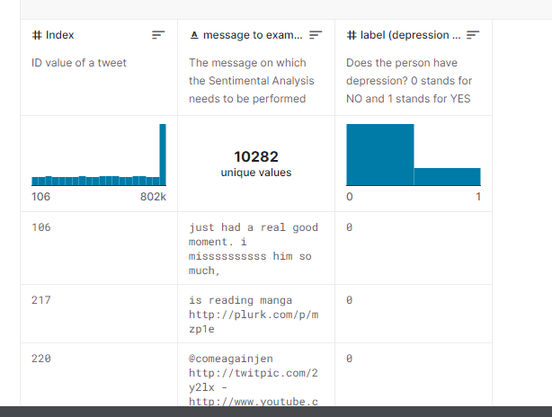
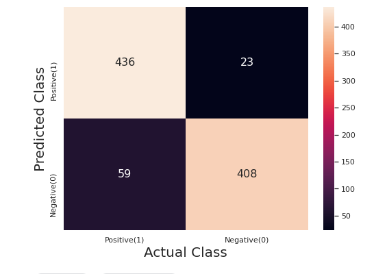
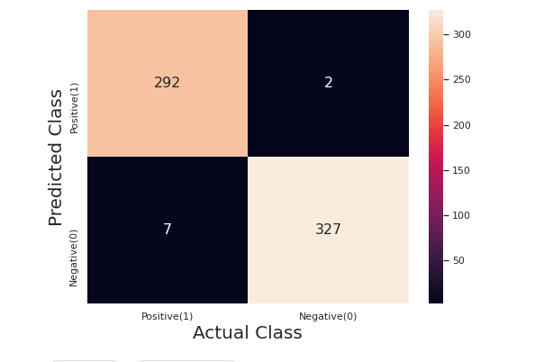
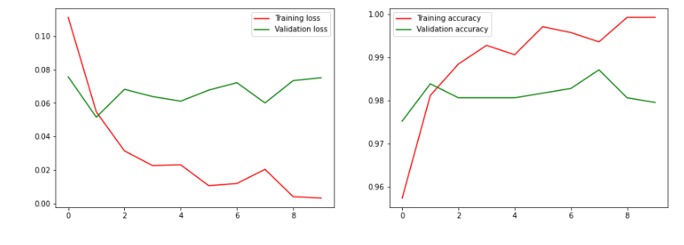

# TweetMind_Unveiling_Emotions


## Motivation
> With its 230 million regular users, Twitter has become such a broad stream of personal expression that researchers are beginning to use it as a tool to dig into public health problems. 

The goal of this experiment is to perform sentiment analysis on random tweets and detect signs of depression in these tweets. The task is classfication of normal and depressive tweets, where depressive tweets are defined as tweets that contain depression-related keywords. 

## Dataset
- **Sentiment140**: the **/kaggle/input/sentimental-analysis-for-tweets/sentiment_tweets3.csv** dataset containing tweets from the Twitter API with the 6 following attributes: Index, message to examine, label (depression result). For the classification task, I balance the dataset in such a way that number of depressing tweet and non depressing tweets are same

The two datasets are labelled respectively (`0` denotes normal tweets, `1` denotes depressive tweets) and shuffle-merged into one big dataset 

### Preprocessing

To prepare the data for training, I remove bad symbols, stop words, punctuations, and expand contractions from the tweets. The tweets are then tokenized. 

The data is then split into training and  testing. 


### Models

**Naive Bayes**

```
mnb = MultinomialNB()
```

**LSTM** 

```

model = Sequential()
model.add(LSTM(32))
model.add(Dense(2, activation = 'softmax'))
```
**BERT** 

```
bert_model = SentenceTransformer('distilbert-base-nli-mean-tokens')
```
## Results

Below are the averaged results of different models used for this task.

 
Naive Bayes -0.9114



LSTM-0.9856



BERT-0.9991


